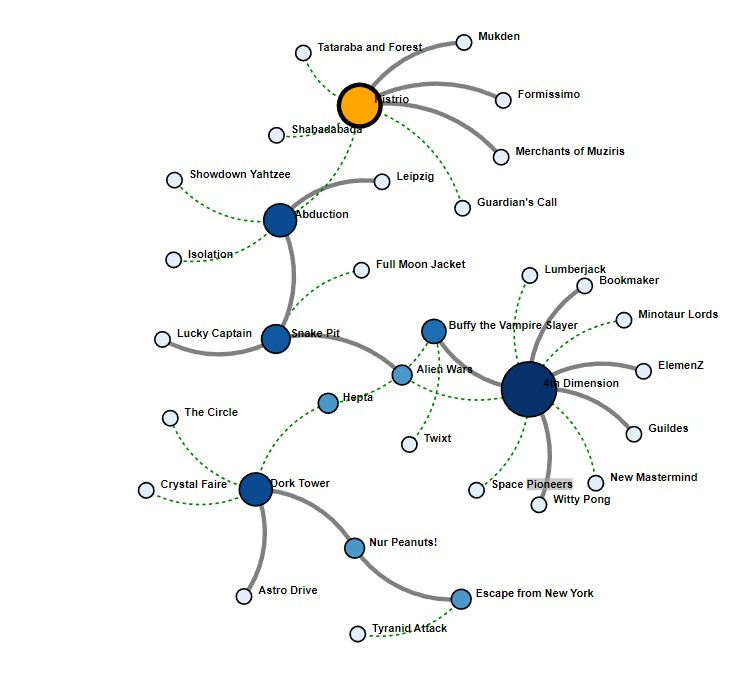

<h2>Force-directed graph layout</h2>

The dataset for this question had inspiration from this post on reddit
network visualization using boardgames in which the author calculates the similarity between board games
based on categories and game mechanics where the edge value between each board game (node) is the
total weighted similarity index. This dataset has been modified and simplified for this question and does not
fully represent actual data found from this post. The provided graph.html file will display a graph (network) in
a web browser. The goal of this question is to experiment with the visual styling of this graph.

<ol>
 <li>
<b>Adding node labels:</b> Modify graph.html to show the node label (the node name, i.e., the source)
   at the top right of each node in bold. If a node is dragged, its label must move with it.
</li>
 <li>
<b>Styling edges:</b> Style the edges based on the “value” field in the links array:
  <uL>
   <li>If the value of the edge is equal to 0 (similar), the edge should be gray, thick, and solid.</li>
   <li>If the value of the edge is equal to 1 (not similar), the edge should be green, thin, and dashed.</li></ul>
  
</li>
 <li><b>Scaling nodes:</b></li>
<li><b>Pinning nodes:</b></li>
  
<a href="graph.html">Force Directed Graph Example with JavaScript/d3 </a> 
   
<a href="https://alpharank.com/spac_001/hg_training/graph.html">Live Demo of the Code </a> 
  
 
  

  
 <kbd></kbd>

<h3> Reference: </h3>
<ol>
<li> <a href="https://omscs.gatech.edu/cse-6242-data-visual-analytics">CSE 6242: Data and Visual Analytics </a> </li>

</ol>
