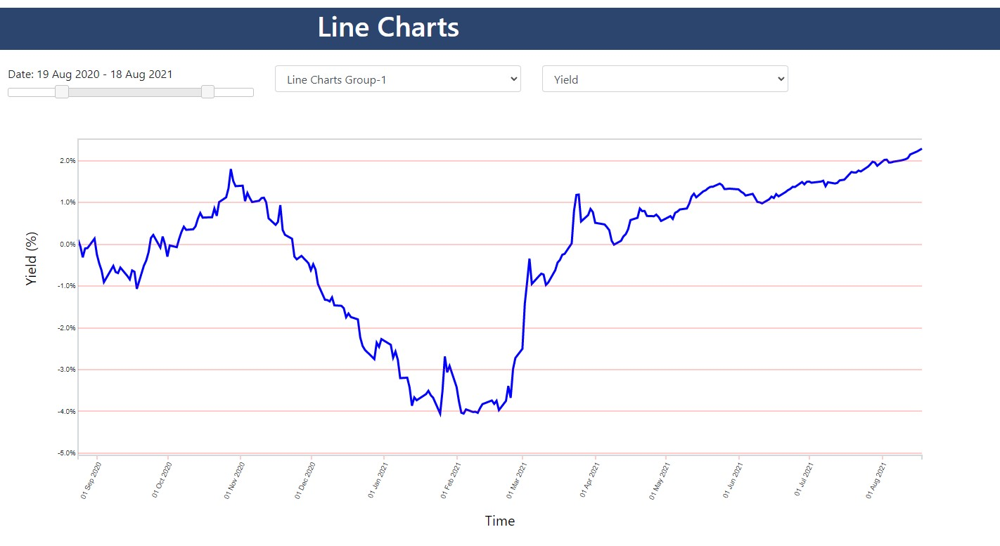

<h2>Interactive Line Chart</h2>

  
<a href="graph.html">Interactive Line Chart Example with JavaScript/d3 </a> 
   
<a href="https://alpharank.com/spac_001/hg/InteractiveLineChart.html">Live Demo of the Code </a> 
  
 
  

  
 <kbd></kbd>

<h3> Reference: </h3>
<ol>
<li> <a href="https://omscs.gatech.edu/cse-6242-data-visual-analytics">CSE 6242: Data and Visual Analytics </a> </li>

</ol>
