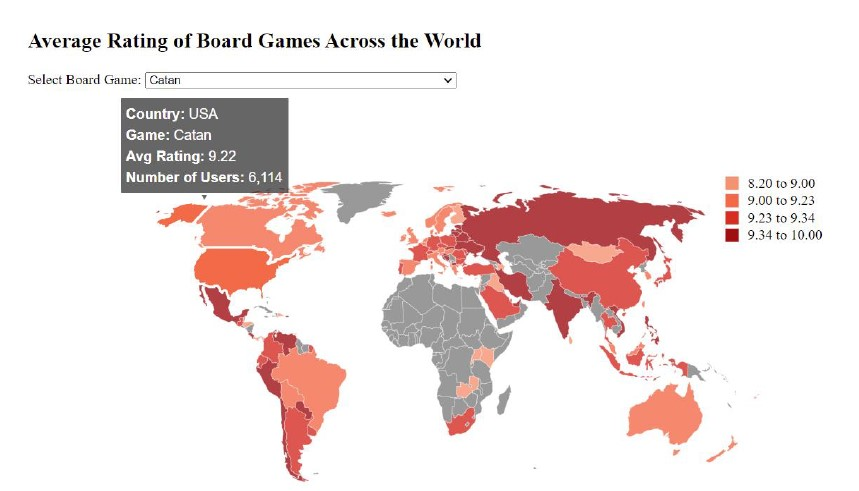

<h2>Choropleth Map Layout</h2>

 The below code is an example of choropleth map and Dropdown is used to enable filtering of data. The tooltip should appear when the mouse hovers over the country. On mouseout, the tooltip should
disappear. 

  
<a href="choropleth.html">Choropleth Map Example with JavaScript/d3 </a> 
   
<a href="https://alpharank.com/spac_001/hg/choropleth.html">Live Demo of the Code </a> 
  

  

  
 <kbd></kbd>

<h3> Reference: </h3>
<ol>
<li> <a href="https://omscs.gatech.edu/cse-6242-data-visual-analytics">CSE 6242: Data and Visual Analytics </a> </li>

</ol>
